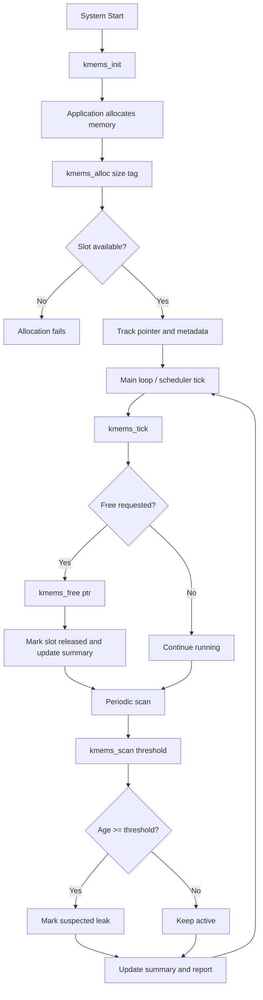

# Design and Flow

## Overview

KmemSentinel Embedded is a userspace prototype with embedded-friendly structure:

1. Initialize tracker state.
2. Wrap allocations and frees.
3. Advance a logical tick counter.
4. Scan tracked blocks older than a threshold.
5. Report leak suspects and memory usage.

This mirrors `kmemleak` intent (find unreferenced allocations over time), but in a compact C component that can be integrated in firmware test harnesses.

It now supports two operational paths:

- Simulation mode: internal allocator tracking for embedded-style testing.
- Live mode: read Linux kernel `kmemleak` output from `/sys/kernel/debug/kmemleak`.

## Core Data Model

- Fixed slot table (`KMEMS_MAX_TRACKED`) avoids dynamic metadata allocation.
- Each slot stores: pointer, size, allocation tick, free state, and tag.
- Summary metrics aggregate operational health.

## Flowchart



## Live kmemleak Flowchart

```mermaid
flowchart TD
    A[Start CLI] --> B{Mode}
    B -- live --> C{trigger scan?}
    C -- yes --> D[write 'scan' to /sys/kernel/debug/kmemleak]
    C -- no --> E[read /sys/kernel/debug/kmemleak]
    D --> E
    E --> F[parse lines with 'unreferenced object']
    F --> G[extract size N from '(size N)']
    G --> H[aggregate objects and bytes]
    H --> I[print report]
    B -- input --> J[read offline file]
    J --> F
    B -- simulate --> K[run embedded allocation simulator]
```

## Test Strategy

- Verify allocation and free counters.
- Verify leak detection by threshold.
- Verify metadata/tag handling.

## Debug Strategy

- Compile with strict flags: `-Wall -Wextra -Werror -pedantic`.
- Run unit tests after every change.
- Keep tracker logic deterministic for reproducible failures.
