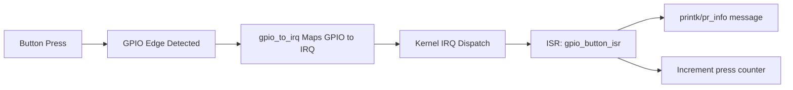

# GPIO Interrupt Button Driver (Linux Kernel Module)

Quick start: driver + DTS + sysfs counter. See full documentation in `DOCUMENTATION.md`.

This project demonstrates a complete GPIO interrupt-based button driver for Linux (Raspberry Pi or generic Device Tree based platform).

## 1) What This Project Does

- Implements a Linux Kernel Module (LKM) as a platform driver.
- Reads a GPIO pin from Device Tree (`button-gpios`).
- Configures GPIO as input.
- Converts GPIO to IRQ with `gpio_to_irq()`.
- Registers ISR with `request_irq()`.
- Interrupt handler prints `printk`/`pr_info` message and increments press counter.
- Cleans up with `free_irq()` and `gpio_free()`.
- Exposes optional read-only sysfs counter: `press_count`.

## 2) Project Structure

- `gpio_button_irq.c` - kernel driver source.
- `Makefile` - out-of-tree module build.
- `dts/button_irq_overlay_rpi.dts` - Raspberry Pi DT overlay example.
- `dts/button_irq_generic.dtsi` - generic Linux/SoC DTS snippet.

## 3) Driver + Device Tree Matching

Driver `of_match_table`:

- Compatible string: `example,gpio-button-irq`
- The DT node must use the same `compatible`.

The driver probe reads:

- `button-gpios` -> GPIO pin for button input.
- `irq-both-edges` (optional boolean) -> configure IRQ on both rising/falling edges.
- `debounce-ms` (optional, default `30`) -> software debounce window.

## 4) Build and Run

From project directory:

```bash
make
sudo insmod gpio_button_irq.ko
dmesg | tail -n 50
```

Remove:

```bash
sudo rmmod gpio_button_irq
dmesg | tail -n 50
```

## 5) Device Tree (Raspberry Pi Overlay Example)

Compile overlay:

```bash
dtc -@ -I dts -O dtb -o button_irq.dtbo dts/button_irq_overlay_rpi.dts
```

Install overlay (example path on Raspberry Pi OS):

```bash
sudo cp button_irq.dtbo /boot/overlays/
```

Enable in `/boot/config.txt`:

```txt
dtoverlay=button_irq
```

Reboot and then load module (`insmod`).

## 6) How To Trigger Interrupt

- Wire a push button between GPIO pin and GND (use pull-up).
- Press the button physically.
- ISR logs should appear in `dmesg`.

Watch logs live:

```bash
sudo dmesg -w
```

Check button press count (optional sysfs interface):

```bash
cat /sys/bus/platform/devices/button-irq@0/press_count
```

## 7) Debugging Guide (If Interrupt Not Triggering)

1. **Check module loaded**
   - `lsmod | rg gpio_button_irq`

2. **Check probe logs**
   - `dmesg | rg "gpio_button_irq|probe|request_irq|gpio_to_irq"`

3. **Validate Device Tree loaded**
   - `dmesg | rg -i overlay`
   - confirm node exists under `/proc/device-tree/` (platform specific).

4. **Verify GPIO number from DT**
   - Ensure `button-gpios = <&gpio PIN FLAGS>;` uses correct controller and pin.

5. **Check IRQ mapping**
   - `dmesg` should show `GPIO=<n> IRQ=<m>` from probe log.

6. **Check interrupt counters**
   - `cat /proc/interrupts | rg -i "gpio|button|irq"`

7. **Electrical checks**
   - Correct pull-up/pull-down resistor.
   - No floating input.
   - Correct active level (active-high vs active-low).

### Common Mistakes and Fixes

- **Wrong compatible string**
  - Fix DT `compatible` to `example,gpio-button-irq`.

- **Incorrect GPIO pin in DT**
  - Use correct pin index and controller.

- **Wrong trigger edge**
  - Enable both edges via `irq-both-edges;` in DT or adjust wiring.

- **IRQ already used/conflict**
  - Check `request_irq` error in `dmesg`, move to another pin.

- **Overlay not applied**
  - Re-check `/boot/config.txt`, overlay name, and reboot.

## 8) Git Integration

Run these commands from `gpio-button-irq`:

```bash
git init
git add .
git commit -m "GPIO interrupt driver"
git branch -M main
git remote add origin https://github.com/shweatank/batch-5.git
git push -u origin main
```

If your remote already exists, update it:

```bash
git remote set-url origin https://github.com/shweatank/batch-5.git
```

## 9) Concepts and Explanation

### What is GPIO interrupt?

A GPIO interrupt allows hardware pin state changes (edge/level) to asynchronously notify the CPU and invoke an ISR in the kernel.

### Why interrupts instead of polling?

- **Lower CPU usage:** no continuous pin polling loop.
- **Better latency:** immediate response on signal edge.
- **Power efficient:** CPU can stay idle until event happens.

### What does `request_irq()` do?

`request_irq()` registers a handler function for an IRQ line, sets trigger behavior via flags, and asks the kernel to route hardware interrupt events to your ISR.

### IRQ Flags quick explanation

- `IRQF_TRIGGER_FALLING`: trigger on high -> low edge (common for pull-up + button to GND).
- `IRQF_TRIGGER_RISING`: trigger on low -> high edge.
- `IRQF_TRIGGER_RISING | IRQF_TRIGGER_FALLING`: trigger on both edges.

In this project:
- Default is `IRQF_TRIGGER_FALLING`.
- If `irq-both-edges;` is present in DT, both-edge trigger is used.

### Role of ISR (Interrupt Service Routine)

ISR is the callback executed in interrupt context when the button event occurs. It should be short and fast: acknowledge/log event, update minimal state (like counter), and defer heavy work if needed.

### Debounce logic (bonus)

Mechanical buttons bounce and can produce multiple edges for one press.  
This driver adds simple software debounce:

- DT property `debounce-ms` sets debounce time window.
- ISR ignores new interrupts arriving before this window expires.
- Default debounce is `30 ms`.

## 10) Flowchart



---

For generic Linux platforms (non-RPi), keep the same `compatible` and `button-gpios` property in your board DTS, then bind this module to that DT node.

## 11) Notes About Permissions During Testing

- `insmod`/`rmmod` require root (`sudo`).
- `dmesg` may be restricted by kernel setting `kernel.dmesg_restrict`.
- If you get `Operation not permitted`, run with sudo:

```bash
sudo insmod gpio_button_irq.ko
sudo dmesg -w
sudo rmmod gpio_button_irq
```
